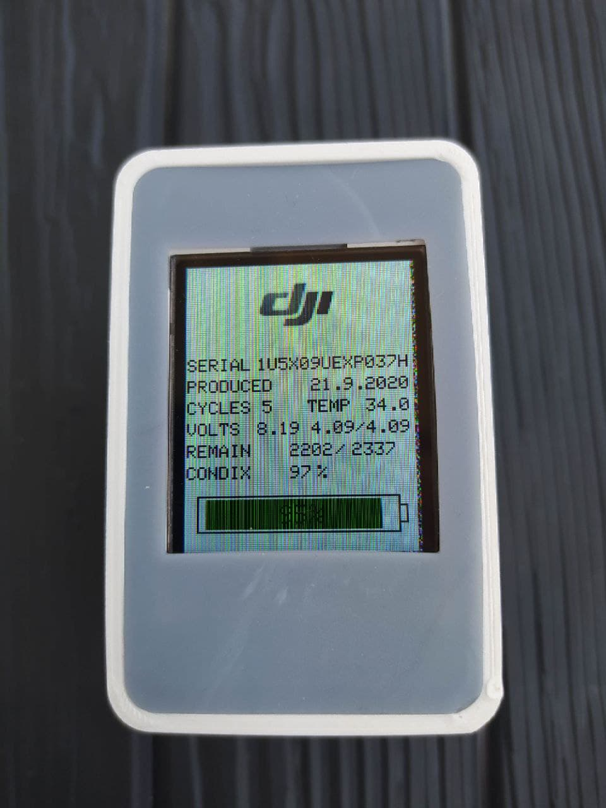

# DJI Mavic Mini Battery Info (ported to platformIO)

Because Mavic Mini battery has not charge level indicator (like other DJI batteries) with this device you are able to quickly check Mavic Mini battery status, level of charge and other informations.
It reads I2C smart battery chip and report its values. All values are also printed to USB serial line.

### required parts
all parts can be purchased on Aliexpress for less than $6

- [Breadboard Jumper wires Cables](https://www.aliexpress.com/item/32725034190.html)
- [1.8" 128x160 65K SPI LCD Display Module ST7735](https://www.aliexpress.com/item/33031122936.html)
- [Arduino Nano ATMEGA328P Mini USB (Nano3 compatible)](https://www.aliexpress.com/item/33013146682.html)

### custom 3D printed case
- [3D printed custom case (Openscad parametrized)](https://www.thingiverse.com/thing:4430174)

### pin connections

 
| Arduino NANO    |  SPI  TFT  |   Mavic Mini battery    |
|-----------------|:----------:|:-----------------------:|
|VIN              |            |            3            |
|GND              |     GND    |            5            |
|5V               |     VDD    |                         | 
|3.3V             |     BLK    |                         |
|A4               |            |            6            |
|A5               |            |            1            |
|D7               |     RST    |                         |
|D8               |     DC     |                         |
|D9               |     CS     |                         |
|ICSP3            |     SCL    |                         | 
|ICSP4            |     SDA    |                         |
